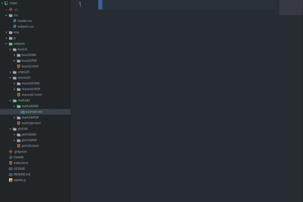

# Notes
Convert Markdown to PDF's and link to them autonomously from my website.

<p align="center">
<a href="https://github.com/Alex0Blackwell/notes">

</a>
</p>

## Table of contents
* [Overview](#overview)
* [Examples](#examples)
* [Technologies](#technologies)
* [Installation](#installation)
* [Usage](#usage)

## Overview
These are my notes from second year computing science. My notes are written as Markdown files and when complete, can be uploaded to my website autonomously.  

After a Markdown file is created or updated, an algorithm converts the file to a PDF file. The newly created PDF file can now be linked to from the website hosted at [notes.alexblackwell.ca](https://notes.alexblackwell.ca/). The creation of the PDF's, and the updating of the website to link to the PDF's is completely autonomized by the *update.js* script.  

The only work left to the user is to write the notes and run the script!

## Examples

> Create and link a PDF from a Markdown file named example.md

<p align="center">
<a href="https://github.com/Alex0Blackwell/notes">

</a>
</p>

## Technologies

- **HTML / CSS**
- **JavaScript**
- **Node.js**
- **markdown-pdf**

## Installation

```
# clone the repo
$ git clone https://github.com/Alex0Blackwell/notes.git

# change the working directory to notes
$ cd notes

# install node.js if it is not installed

# install markdown-pdf
$ python3 -m pip install -r requirements.txt
```

## Usage

To use this for your own classes, you must change each instance of my class names to the name of your classes.  
Additionally, if you wish to host the website yourself, the *CNAME* file must be changed or removed.

```
Notes - v-0.0.1-alpha (2020 Sept. 8)

Usage: node update.js [arguments]
converts Markdown to PDF and adds PDF's to website.

Arguments:
-n  or  --new:     Compile newly added Markdown files to PDF and update website
-h  or  --help:    Print Help (this message) and exit
```

### Create a Note
Create a Markdown file with any name. This Markdown file should be in a **[class-name]MD** folder where **[class-name]** is the name of the class you are writing the note for. When the Markdown note is complete, the script to make it a PDF and link it to the website can be run.  

```
node update.js
```

The file is now updated with the new *.md* note linked as a *.pdf*!  

## License
Licensed under the [GNU General Public License v3.0](LICENSE).
